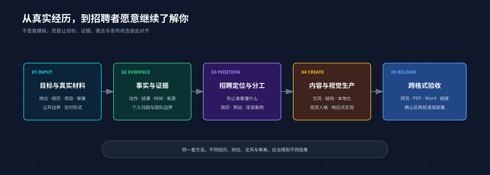

# Zane Career Skills

简体中文 | [English](README.en.md)

> 不套简历模板。把你真实做过的事，变成一套能被招聘者快速看懂、愿意继续深读的职业资产。

[](VERSION.md)
[](docs/skill-inventory.md)
[](LICENSE)

一条命令安装 11 个可独立调用的 Agent Skills，覆盖经历盘点、招聘定位、多语言简历、作品集网站、案例叙事、视觉转译、隐私边界与发布验收。

**适用于 Claude Code、Codex，以及其他支持 Agent Skills 的工具。**

[快速开始](#快速开始) · [它解决什么](#它解决什么) · [能力一览](#能力一览) · [安装](#安装) · [方法边界](#方法边界)



## 它解决什么

你可能并不缺经历，真正缺的是一条把经历变成招聘判断的链路。

| 你现在的处境 | 这套 Skills 帮你推进到 |
| --- | --- |
| 只有旧简历、项目文件和零散回忆 | 建立事实台账，找出真正值得写的证据 |
| 经历很多，但招聘者看不出你适合什么岗位 | 明确目标读者、职业定位和主张层级 |
| 简历写成了工作流水账 | 把职责改造成有证据、有归因边界的成果表达 |
| 想做作品集，却不知道网站、深读页和简历如何分工 | 建立从 30 秒扫读到案例深读的阅读路径 |
| 中文不错，英文版却像逐句翻译或审计报告 | 按招聘市场重写语气、信息顺序与表达方式 |
| 参考了喜欢的网站，最后仍像套模板 | 从审美偏好和内容关系推导自己的视觉人格 |
| 网页、PDF、Word、二维码和线上版本互相漂移 | 做跨格式、跨语言、跨设备的发布前验收 |
| 担心前雇主数据、归因或案例表述越界 | 决定哪些公开、模糊、后置到面试或删除 |

## 快速开始

### 1. 安装

```bash
npx -y skills add xuehuafu233-alt/zane-career-skills -g --all
```

### 2. 直接告诉 Agent 你的处境

不知道从哪个 Skill 开始时，调用总入口：

```text
请使用 zane-career-assets。
我想申请消费品牌市场负责人，目前只有一份旧简历、几个项目文件和零散数据。
先帮我建立事实台账和招聘定位，再判断我需要简历、作品集网站还是深读案例。
保留我的表达方式，不要套固定模板，也不要虚构经历。
```

已经知道要做什么，可以直接调用专项 Skill：

```text
请使用 zane-career-resume-builder，把这份中文简历重构成面向品牌市场总监的两页候选版。

请使用 zane-career-portfolio-website-design，根据我的岗位目标、案例证据和视觉偏好，从零设计作品集网站。

请使用 zane-career-case-editor-zh，保留我的文风和信息密度，删除 AI 式解释过满与重复收束。

请使用 zane-portfolio-multi-format-qa，检查桌面端、390px 手机端、PDF、Word、二维码和线上链接。
```

## 它怎样工作

```text
你的目标岗位、经历、证据与审美
                 ↓
        事实台账与招聘定位
                 ↓
       决定简历／网站／案例如何分工
                 ↓
        内容、结构、视觉与本地化
                 ↓
      网页／PDF／Word／链接发布验收
                 ↓
           用户确认、投递或部署
```

它不会把“文件已经生成”写成“已经可以投递”。候选版、用户确认版、已投递和已部署是不同状态。

## 能力一览

| 工作目标 | 主要入口 | 常见产出 |
| --- | --- | --- |
| 不知道该做哪些职业资产 | `zane-career-assets` | 事实台账、定位、载体分工与下一步 |
| 从零完成整套职业资产 | `zane-career-portfolio-builder` | 简历、作品集、案例、索引与交付状态 |
| 创建中文、英文或其他语言简历 | `zane-career-resume-builder` | 招聘者扫读结构、多语言文案与 PDF 验收 |
| 设计作品集的信息架构 | `zane-career-portfolio-architecture` | 首页钩子、案例深读、作品索引和投递入口 |
| 构建个性化作品集网站 | `zane-career-portfolio-website-design` | 视觉人格、页面系统、响应式实现与整站 QA |
| 写清职业案例 | `zane-career-case-editor-zh`、`zane-evidence-weighted-case-storytelling` | 判断、动作、结果、代价与证据权重 |
| 处理前雇主数据 | `zane-former-employer-data-redactor` | 保留、模糊、后置口述或移除的公开决策 |
| 写招聘平台第一句话 | `zane-career-application-greeting` | 中文、英文投递招呼语与正确语言入口 |
| 验收发布版本 | `zane-portfolio-multi-format-qa` | 桌面／手机、网页／PDF／Word、二维码与链接检查 |
| 把视觉参考变成原创实现方向 | `zane-design-reference-to-prompt` | 设计判断、响应式规则与开发提示词 |

完整目录与边界见 [Skill Inventory](docs/skill-inventory.md)。

## 为什么不是模板

这套库公开的是判断方法，不是 Zane 的简历、岗位路径、网站配色或页面骨架。

同一组 Skills 面对不同用户，应当产生不同结果，因为它会重新读取：

- 目标岗位、职级、市场和招聘渠道；
- 用户真实经历、证据强度与公开边界；
- 招聘者需要先看到什么、后看到什么；
- 用户自己的文风、信息密度和视觉审美；
- 最终需要网页、PDF、Word 还是组合交付。

如果只替换姓名和颜色，其他内容完全一样，那不是这套方法的目标。

## 安装

### 推荐：安装全部 Skills

```bash
npx -y skills add xuehuafu233-alt/zane-career-skills -g --all
```

安装完成后，先输入：

```text
请使用 zane-career-assets，先判断我现在最需要哪一项职业资产。
```

也可以只安装或调用单个 Skill。具体安装位置和调用语法以你的 Agent 为准。

## 使用前准备

不必一次整理完所有资料。先提供这些信息即可开始：

- 想申请的岗位、级别和市场；
- 一份旧简历或一段经历说明；
- 能核验的项目、动作、结果和时间；
- 喜欢与不喜欢的表达、页面或视觉参考；
- 哪些信息可以公开，哪些只能面试口述；
- 你希望最后拿到什么文件或链接。

资料不足时，Skill 应留下待补证据，而不是替你编一个完整故事。

## 方法边界

- 不虚构经历、数字、客户、结果或第三方评价；
- 不把团队结果全部归到个人名下；
- 不要求把所有复杂事实都塞进简历和首页，但重大误导、隐私和合规风险必须处理；
- 不用“全面审计”阻断可逆的下一步，也不靠免责说明代替判断；
- 不把机器检查通过冒充视觉通过、用户确认、正式投递或招聘结果。

## 来源与许可证

本仓库来自真实职业资产项目中的反复问题、失败复盘和方法沉淀；不包含个人简历、公司内部材料、联系方式、客户数据或私人本地路径。

方法来源和第三方边界见 [Provenance](docs/provenance.md)。除另有说明外，本仓库采用 [MIT License](LICENSE)。

作者：Zane
